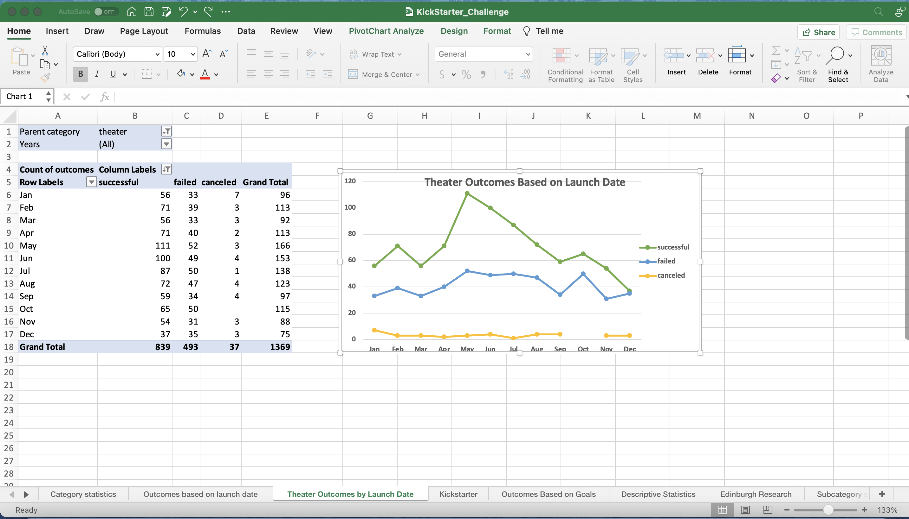
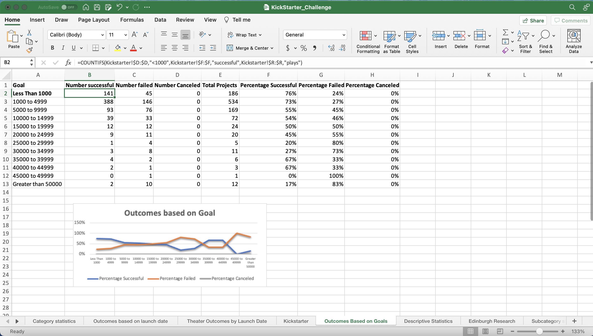

# kickstarter-analysis
Performing analysis on Kickstarter data to uncover trends

# **Kickstarting with Excel
##Module 1 Challenge

## **Overview of Project
>Louises's play came close to its fundraising goal in a short amount of time.Now, she wants to know how other campaigns fared in relations to their funding goal and launch dates. 

Using the Kickstarter dataset we can determine the best time to launch a campaign to achieve their funding goals.
>1. Create two new analyses: outcomes based on goals and outcomes based on launch date
>2. Create pivot tables and graphing in Excel to visualize campaign outcomes ("successful,""failed,"and "canceled")based on launch date.
>3. Create pivot tables and graphing in Excel to visualize the percentage of "successful","failed", and "canceled" plays based on the funding goal amount.
>4. Results:provide a written analysis and conclusions

### **Purpose
The purpose of this analysis is to determine how the different "Theater" campaigns fared in relation to their launch dates and their funding goals.

## **Analysis and Challenges

### **Analysis of Outcomes Based on Launch Date

1. I created a pivot table from the KickSarter worksheet, and placed the pivot table in a new sheet.

2. On the PivotTable Fields I set columns to "outcomes", values to "outcomes",rows to "date created conversion", and set filters based on " Parent Category" and " Years"
3. I filtered the column labels to only show "successful","failed",and"canceled" outcomes

4. Filter the " Parent Category" to show only "theater"
5. Sort the campaign outcomes in descending order,"successful" is the first label.

6. Create a line chart from the pivot table
7. Analyze and conclude

### **Analysis of Outcomes Based on Goals

1. I created a new sheet and labe it" Outcomes Based on Goals"
2. In the " Outcomes Based on Goals"sheet, the following collumns were created: Goal, Number Successful, Number Failed,Number Canceled, Total Projects, Percentage Successful, Percentage Failed, Percentage Canceled.

3. In the Goal column ranges were created from >1000 to <50000
4. Using the Countifs()formula and setting each criteria and range based on the goal column.

5. Next i populated the "Total Projects" column by using the SUM()formula.
6. The percentage columns were set to percentage next I calculated the percentage of successful, failed and canceled projects for each row by divding the number of successful, failed, and canceled by the total projects for each of the ranges. Ex:B2/E2 for percenatge successful. C2/E2 for percentage failed.

### Challenges and Difficulties Encountered

A challenge and difficulty that I encountered was the manipulation of the COUNTIFS()function. The first criteira is the goal column in the KickStarter sheet and the range is to be determined by the goal column in the "Outcomes Based on Goals" sheet.The second criteria is the "Outcome"column in the "KickStarter" sheet with a range(successful,failed,canceled) based on the number columns on the "Outcomes Based on Goals" worksheet.The third criteria is the "Subcategory"column on "KickStarter"sheet with range set to"plays".However, when the goal is between two numbers a fourth criteira needs to be added, this is where is challenging, between the second and third criteria.This new criteira is the "goal" column in the "KickStarter"sheet and the range is set to the highest number of the dollar-amount ranges. I was able to overcome this challenge by watching the video provided in the portal.

## **Results

-**What are two conclusions you can draw about the Outcomes based on Launch Date?** First, based on the "Outcomes based on Launch Date"chart we can determine that the best time to launch a successful theater campaign is in between the months of May-Jun, the peak of successful campaigns is in May. Second, the chart shows that the success rate for a campaign declines after the month of May.Also,June, July and october all had roughly the same number of failed campaings launched. Furthermore, canceled campgains stay pretty steady across the years.

-**What can you conclude about the Outcomes based on Goals?** It can be concluded from the "Outcomes based on Goals" sheet and chart that Goals set below 1000 have a higher chance of success. In other words the success rate for campaigns that set a goal of less than 1000 have a sucess rate of approximately 80%. Also, it is important to note that between goals of 35000-44999 the sucess rate is constant. For percentage failed, the chart shows that campaigns with a goal of less than 1000 has a lower chance of failing and goals larger than 45000 have a higher percenatge of failure.

-**What are some limitations of this dataset?**
This dataset does not account for other factors that could be affecting the data such as small data sample and outiliers.The analysis was based on data from multiple countries, therefore it is a general analysis. Also," Outcomes based on launch" is filtered by parent category "theater" while "Outcomes based on goals" is filtered by subcategory "plays". Therefore it would be wise to create additional tables and graphs with the same parent category and subcategory.

-**What are some other possible tables and/or graphs that we could create?**
Some possible table and graphs that could be created to further analyze the relation between outcome,launch dates and goals is a pivot table of " Outcomes based on launch date" where we filter by subcategory "plays" instead of filtering for Parent category "theater". Another possible table and graph is to filter the "Outcome based on goals" pivot table by Parent Category and "theater". Additionaly, both pivot tables should be filtered by "country"to narrow the scope. Furthermore, a table of outcomes based on end date should also be considered, to determine the average amount of time a campaign stayed open to achieve their goals.
